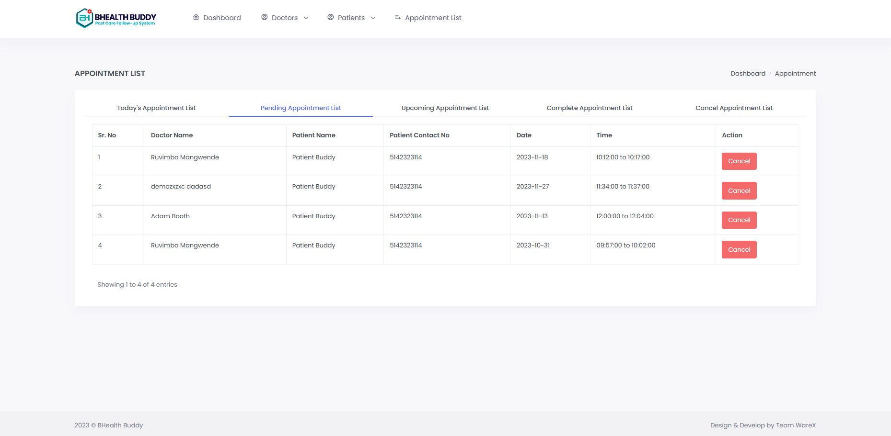
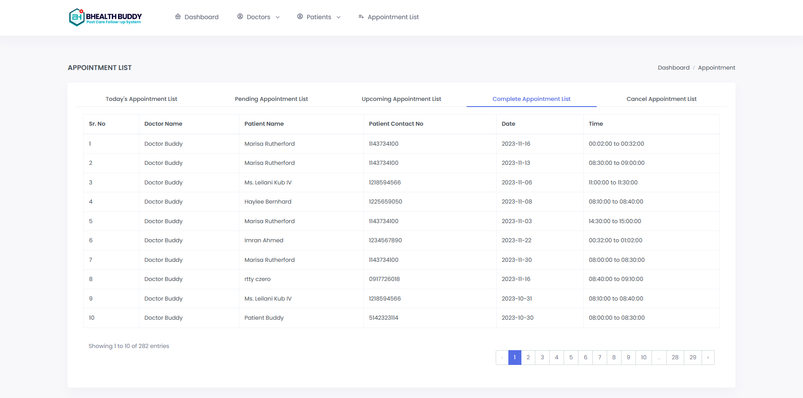
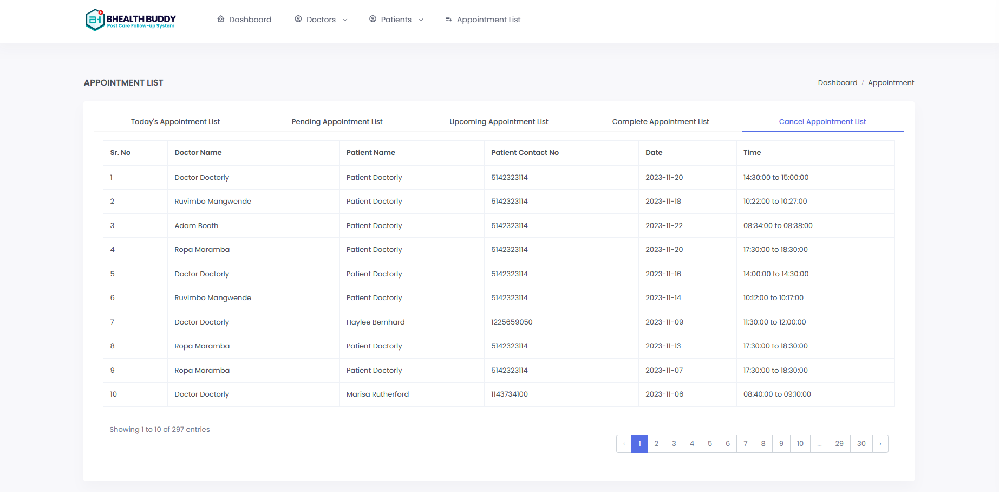

# Appointment Management Web Platform Setup Guide

Welcome to the setup guide for the BHealth Buddy Appointment Management Web Platform. This guide will walk you through the steps to clone the repository, set up the environment, install necessary packages, and run the platform on your local machine.


## Prerequisites
Before you begin, make sure you have the following installed:

- Git
- Node.js (LTS version recommended)
- npm (comes with Node.js)


## Step 1: Clone the Repository

1. Open your terminal or command prompt.
2. Navigate to the folder where you want to clone the repository.
3. Run the following command:

```
git clone <repository-url>
```

4. Change directory to the cloned folder:
```
cd <cloned-folder-name>
```


## Step 2: Initialize npm and Install Dependencies
1. In the root directory of the cloned repository, initialize npm (Node Package Manager) which will create a package.json file for your project:
```
npm init -y
```
2. Install the required Node.js packages for the project:
```
npm install body-parser dotenv express express-session mongoose
```

## Step 3: Database Setup with MongoDB Atlas
1. Sign up or log in to MongoDB Atlas.
2. Create a new project and build a new cluster.
3. Within your cluster, create a database for the project.
4. Navigate to the "Database Access" section, create a new database user with read and write permissions.
5. In the "Network Access" section, add your IP address to the IP whitelist.
6. Find the "Connect" option in your cluster, choose "Connect your application", and copy the connection string.
   
## Step 4: Configure Environment Variables
1. In the root directory of your project, create a .env file.
2. Paste the MongoDB connection string into the .env file in the following format:
```
MONGODB_URI="your-connection-string-here"
```
3. Replace ```your-connection-string-here``` with your actual MongoDB Atlas connection string.

## Step 5: Activate MongoDB Atlas Data API (For PaduAI Chatbot)
1. Navigate to the "Data API" section in your MongoDB Atlas Dashboard.
2. Activate the Data API and note down your API key and endpoint.
3. Update the action nodes in the PaduAI dashboard with your new API key and endpoint for seamless integration.

## Running the Web Platform
1. To start the server, run the following command in your terminal:
```
node server.js
```
2. Open your web browser and navigate to ```http://localhost:3000``` to view the platform.


Congratulations! You have successfully set up and run the BHealth Buddy Appointment Management Web Platform on your local machine. For any issues, please refer to the project's GitHub issues or contact the project maintainers.


## Screenshots of the web platform:


### Dashboard


### Appointment Lists








